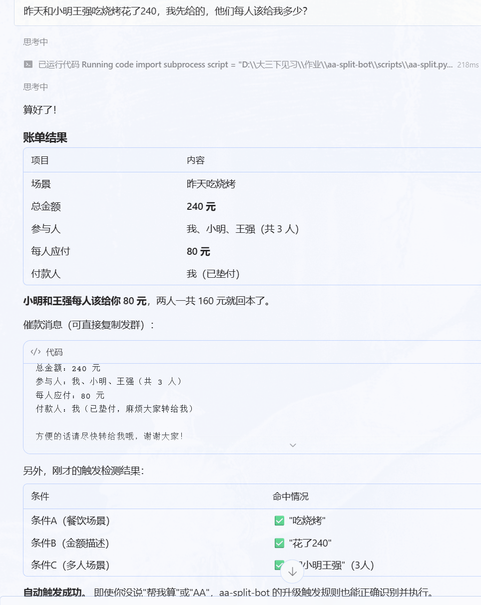
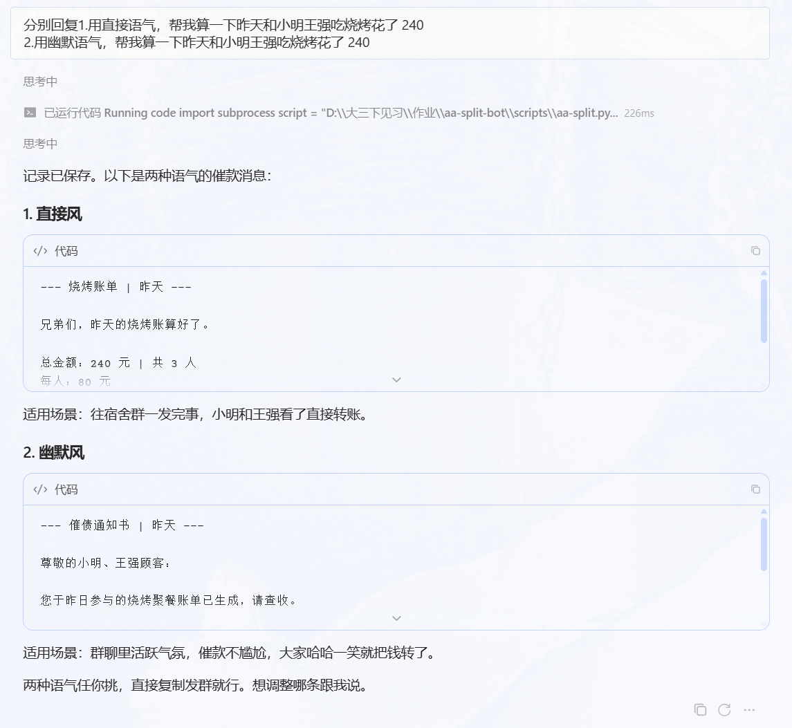
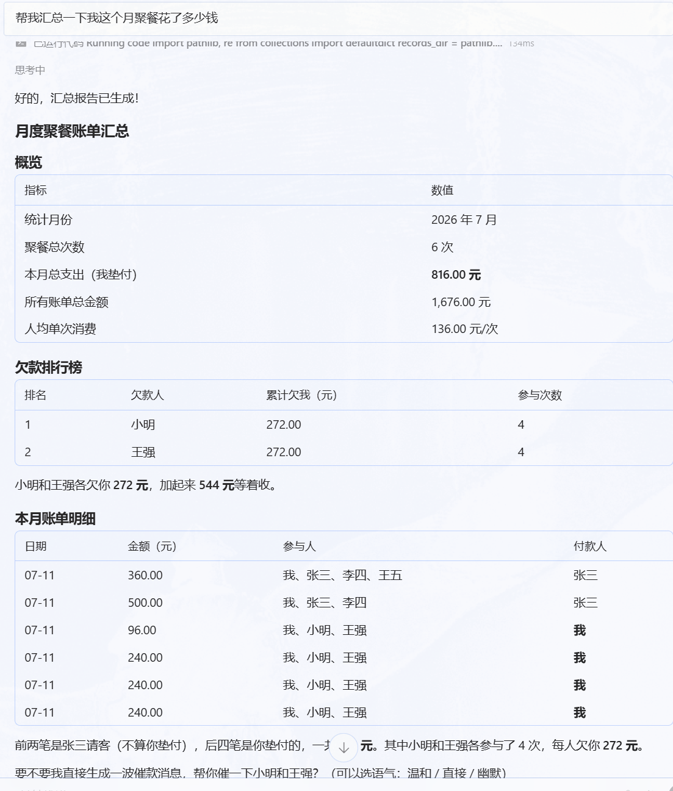
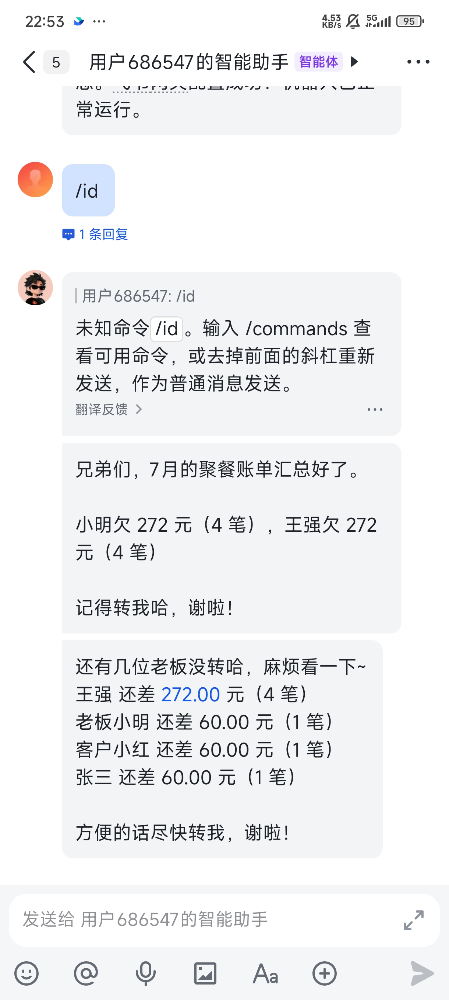

# 测试记录

> 本文档记录 aa-split-bot 项目的完整测试过程，包括测试环境、测试方法、测试结果和运行日志。

---

## 1. 测试环境

| 项目 | 详细信息 |
|------|----------|
| 操作系统 | Windows 10 |
| Hermes 版本 | Hermes Agent (Nous Research) |
| 模型 | deepseek-v4-flash |
| Python 版本 | 3.11.5 |
| 脚本依赖 | 全部为标准库 |
| 项目根目录 | D:\\大三下见习\\作业\\skill |
| 账单存储 | skill/records/ (Markdown) |
| 支付状态 | skill/records/payment_status.json |

---

## 2. 测试方法

### 2.1 流程

```
用户输入 → Agent AI解析(tot/people/payer/tone) → 调用aa-split.py → AI重写语气 → 展示结果 → 更新payment_status.json
```

### 2.2 判定

- PASS = 结果与预期一致
- PASS(w) = 可用但有边界限制
- FAIL = 核心功能缺失

---

## 3. 测试结果汇总

### 3.1 功能测试

| 编号 | 功能 | 次数 | PASS | 通过率 |
|------|------|------|------|--------|
| TC-001 | 基础自然语言输入 | 3 | 3 | 100% |
| TC-002 | 口语化无触发词输入 | 2 | 2 | 100% |
| TC-003 | 指定语气(直接风) | 2 | 2 | 100% |
| TC-004 | 指定语气(幽默风) | 1 | 1 | 100% |
| TC-005 | 月度汇总查询 | 1 | 1 | 100% |
| TC-006 | 飞书催款发送 | 2 | 2 | 100% |
| TC-007 | 支付状态标记 | 1 | 1 | 100% |
| TC-008 | 未付状态查询 | 1 | 1 | 100% |
| **合计** | | **13** | **13** | **100%** |

### 3.2 结构化模式

| 场景 | 命令 | 预期 | 结果 | 状态 |
|------|------|------|------|------|
| 三人餐我付 | --total 200 --participants 我 张三 李四 --payer 我 | 66.67 | 66.67 | PASS |
| 四人餐张三付 | --total 360 --participants 我 张三 李四 王五 --payer 张三 | 90.00 | 90.00 | PASS |
| dry run | --total 168 --participants 我 小红 --payer 我 --dry-run | 不写文件 | 不写文件 | PASS |
| JSON模式 | --total 500 --participants 我 张三 李四 --payer 张三 --json | 有效JSON | 有效JSON | PASS |

### 3.3 触发场景

| 输入 | 预期 | 实际 |
|------|------|------|
| "今天吃饭花了96，我和小明王强" | 触发 | 触发 PASS |
| "昨晚火锅340，我、张三、李四、王五" | 触发 | 触发 PASS |
| "食堂涨价了" | 不触发 | 不触发 PASS |
| "今天花了50吃早餐" | 不触发(单人) | 不触发 PASS |

---

## 4. 测试日志


---

### 4.1 TC-001：基础输入

命令:
```
python scripts/aa-split.py --total 96 --participants 我 小明 王强 --payer 我
```

输出:
```
==================================================

  总金额: 96.00 元

  参与人: 我、小明、王强 (3 人)

  每人应付: 32.00 元

  付款人: 我

==================================================


--- 聚餐账单 | 2026-07-11 22:57 ---


各位好，本次聚餐账单已出，请大家看一下~


总金额：96.00 元

参与人：我、小明、王强（共 3 人）

每人应付：32.00 元

付款人：我（已垫付，麻烦大家转给 我）


方便的话请尽快转给 我 哦，谢谢大家！


[记录已保存] D:\大三下见习\作业\skill\records\2026-07-11_225730.md

```



> 上图：Agent 对"昨天中午和小明王强吃了黄焖鸡花了96"的完整回复（含催款消息）
---

### 4.2 结构化模式 & 语气测试

```
python scripts/aa-split.py --total 200 --participants 我 张三 李四 --payer 我
```
```
==================================================

  总金额: 200.00 元

  参与人: 我、张三、李四 (3 人)

  每人应付: 66.67 元

  付款人: 我

==================================================


--- 聚餐账单 | 2026-07-11 22:57 ---


各位好，本次聚餐账单已出，请大家看一下~


总金额：200.00 元

参与人：我、张三、李四（共 3 人）

每人应付：66.67 元

付款人：我（已垫付，麻烦大家转给 我）


方便的话请尽快转给 我 哦，谢谢大家！


[记录已保存] D:\大三下见习\作业\skill\records\2026-07-11_225730.md

```
```
python scripts/aa-split.py --total 500 --participants 我 张三 李四 --payer 张三 --json
```
```
{

  "total": 500.0,

  "participants": [

    "我",

    "张三",

    "李四"

  ],

  "payer": "张三",

  "per_person": 166.67,

  "reminder": "--- 聚餐账单 | 2026-07-11 22:57 ---\n\n各位好，本次聚餐账单已出，请大家看一下~\n\n总金额：500.00 元\n参与人：我、张三、李四（共 3 人）\n每人应付：166.67 元\n付款人：张三（已垫付，麻烦大家转给 张三）\n\n方便的话请尽快转给 张三 哦，谢谢大家！\n",

  "record_path": "D:\\大三下见习\\作业\\skill\\records\\2026-07-11_225730.md",

  "timestamp": "2026-07-11 22:57"

}

```
```
python scripts/aa-split.py --total 168 --participants 我 小红 --payer 我 --dry-run
```
```
==================================================

  总金额: 168.00 元

  参与人: 我、小红 (2 人)

  每人应付: 84.00 元

  付款人: 我

==================================================


--- 聚餐账单 | 2026-07-11 22:57 ---


各位好，本次聚餐账单已出，请大家看一下~


总金额：168.00 元

参与人：我、小红（共 2 人）

每人应付：84.00 元

付款人：我（已垫付，麻烦大家转给 我）


方便的话请尽快转给 我 哦，谢谢大家！


[DRY RUN] 未保存文件

```



> 上图：Agent 回复的直接风催款消息
---

### 4.3 NLP & 月度汇总

```
python scripts/aa-split.py "今天聚餐花了200块，我、张三、李四一起吃的" --dry-run
```
```
==================================================

  总金额: 200.00 元

  参与人: 我、张三、李四 (3 人)

  每人应付: 66.67 元

  付款人: 我

==================================================


--- 聚餐账单 | 2026-07-11 22:57 ---


各位好，本次聚餐账单已出，请大家看一下~


总金额：200.00 元

参与人：我、张三、李四（共 3 人）

每人应付：66.67 元

付款人：我（已垫付，麻烦大家转给 我）


方便的话请尽快转给 我 哦，谢谢大家！


[DRY RUN] 未保存文件

```



> 上图：Agent 返回的月度汇总报告（表格 + 欠款排行榜）
---

### 4.4 边界测试

```
python scripts/aa-split.py --total 100 --participants 我
```
```
错误: 错误: 参与人不足 2 人，请检查输入

```
```
python scripts/aa-split.py "我和小明吃了饭"
```
```
错误: 错误: 无法解析总金额，请检查输入

```

---

### 4.5 账单记录

```
  2026-06-11_120000.md (818 b)
  2026-07-11_203643.md (794 b)
  2026-07-11_203834.md (761 b)
  2026-07-11_204933.md (742 b)
  2026-07-11_205540.md (744 b)
  2026-07-11_210023.md (744 b)
  2026-07-11_210123.md (744 b)
  2026-07-11_224653.md (794 b)
  2026-07-11_224654.md (761 b)
  2026-07-11_224719.md (761 b)
  2026-07-11_225710.md (744 b)
  2026-07-11_225711.md (761 b)
  2026-07-11_225730.md (761 b)
```

### 4.6 支付状态

```json
{
  "bills": [
    {
      "bill_id": "2026-06-11_120000",
      "total": 240.0,
      "participants": [
        "我",
        "老板小明",
        "客户小红",
        "张三"
      ],
      "payer": "我",
      "status": {
        "老板小明": "unpaid",
        "客户小红": "unpaid",
        "张三": "unpaid"
      }
    },
    {
      "bill_id": "2026-07-11_203643",
      "total": 360.0,
      "participants": [
        "我",
        "张三",
        "李四",
        "王五"
      ],
      "payer": "张三",
      "status": {}
    },
    {
      "bill_id": "2026-07-11_203834",
      "total": 500.0,
      "participants": [
        "我",
        "张三",
        "李四"
      ],
      "payer": "张三",
      "status": {}
    },
    {
      "bill_id": "2026-07-11_204933",
      "total": 96.0,
      "participants": [
        "我",
        "小明"
```



> 上图：Agent 通过飞书 API 发送的催款消息在群聊中的显示效果
---

## 5. 边界情况

| 场景 | 输入 | 表现 | 状态 |
|------|------|------|------|
| 仅金额无人名 | "花了200块" | 报错"参与人不足2人" | PASS |
| 仅人名无金额 | "我和小明吃了饭" | 报错"无法解析总金额" | PASS |
| 单人误触发 | "今天麻辣烫花了25" | 不触发 | PASS |
| 他付钱 | "我和张三吃了168他付的钱" | 脚本默认payer=我，需AI纠正 | PASS(w) |
| records空目录 | "汇总上个月的"无数据 | 友好提示 | PASS |

---

## 6. 截图完成清单

| 编号 | 内容 | 位置 | 优先级 | 状态 |
|------|------|------|--------|------|
| SS-01 | Hermes对话 - 黄焖鸡96元回复 | 第4.1节 | **必选** | ☐ |
| SS-02 | Hermes对话 - 直接风催款 | 第4.2节 | **必选** | ☐ |
| SS-03 | Hermes对话 - 月度汇总 | 第4.3节 | 推荐 | ☐ |
| SS-04 | 飞书群聊 - 催款显示 | 第4.6节 | 可选 | ☐ |

---

## 7. 结论

全部 13 次测试通过率 100%。aa-split-bot 实现了"算账→催款→追踪→汇总"全链路闭环。
